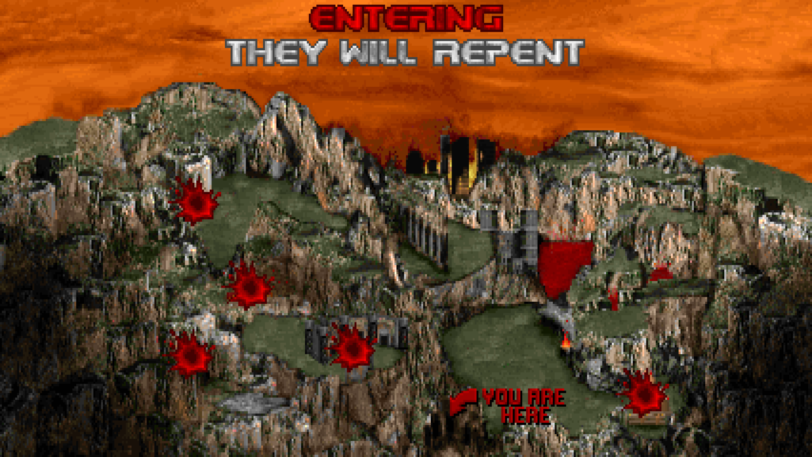
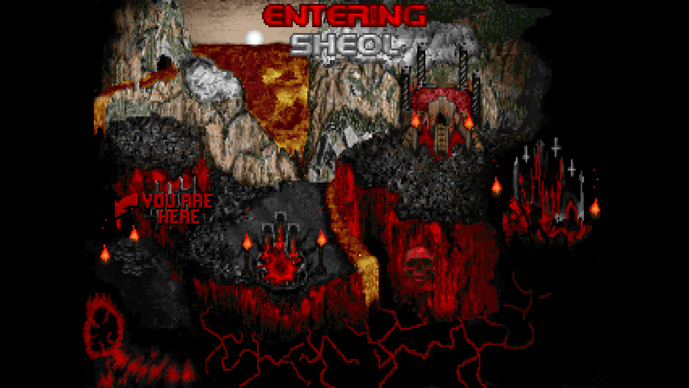
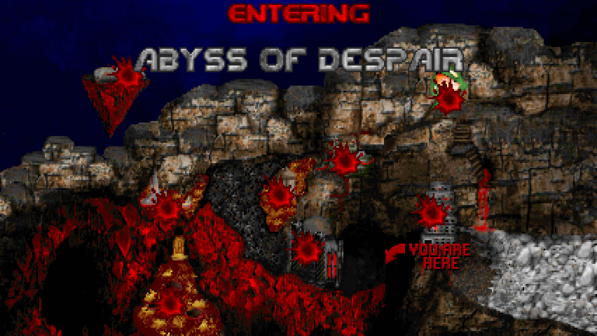
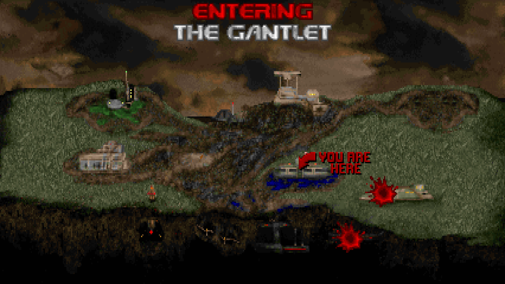
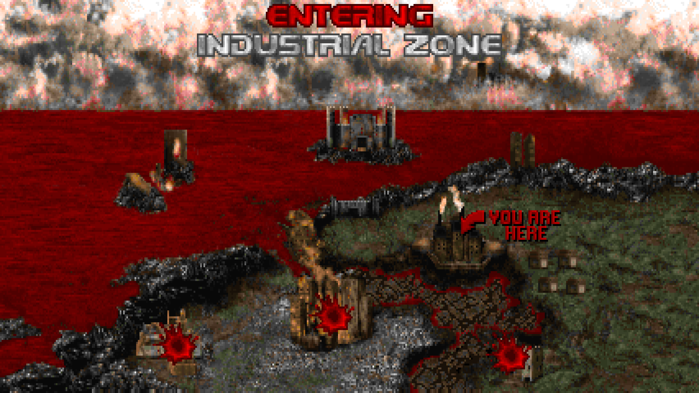
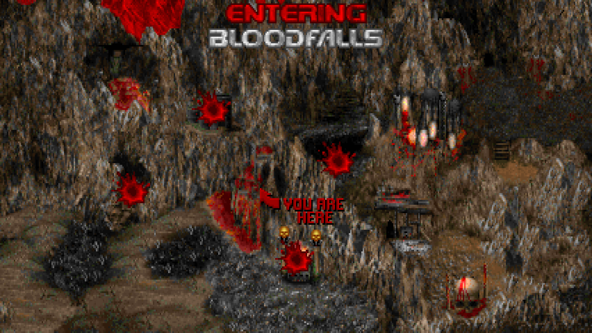

# Doom-Intermission-Map-Screen-Project

Doom Intermission Map Screen Project is a collection of intermission map screens mods for the IWADS + Sigil, Sigil2.

# Sourceports

It has been tested on ports such as Woof, Nugget, Odamex and GZDoom.

# Screenshots

	
Thy Flesh Consumed

	

	
Sigil & Sigil II

	
	

	
Doom II

	
	
	

# Credits

Map graphics done by DevilMyEyes.

Blood splat and arrow graphics based on Legacy of Rust, "id1.wad".

ZDoom intermission script done by DevilMyEyes, based on Skunk's original "thyinterpic".

elf-alchemist for porting to ID24's "interlevel" lump standard.

Sigil & Sigil II custom M_SKULLs based on Christoper Lovell's artwork used in Sigil & Sigil II.

# Links

Twitter - https://x.com/DevilMyEyes

Support me on Ko-Fi! - https://ko-fi.com/devilmyeyes

# Notes

Doom 2 Intermission Map Screen features an episodic structure based on the old versions of SETUP.EXE give names for these episodes.

Final Doom Intermission Map Screens are yet to be made ;)
